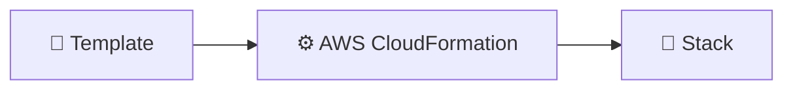
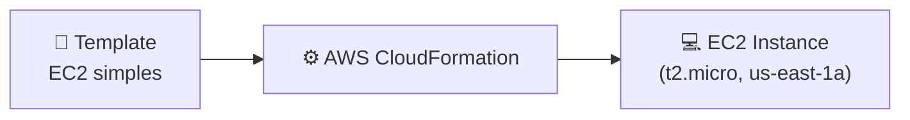
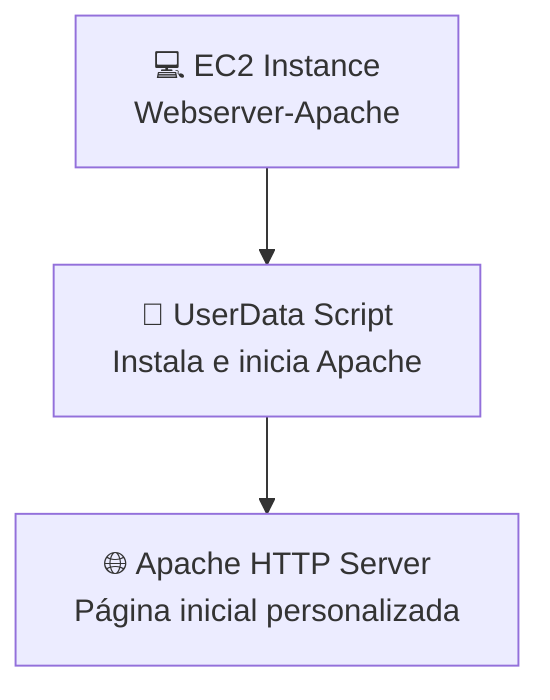
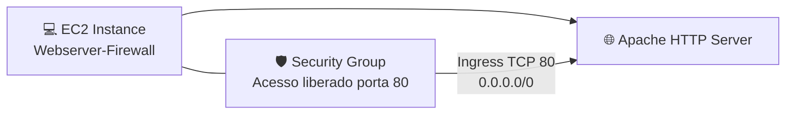

# desafio-cloudformation-aws
Este repositório contém exemplos práticos de AWS CloudFormation desenvolvidos por Alexsandro Lechner, demonstrando como automatizar a criação de recursos na AWS. 

### Definição 

O AWS CloudFormation é um processo que auxilia na automação de criação de recurso na AWS por meio de templates JSON ou YAML. Podemos utilizar os templates quantas vezes quisermos e pagamos apenas pelas stacks criadas (conjuntos de recursos, ex: EC2, RDS, S3, etc).

Além de ser um processo automatizado, conseguimos versionar estes templates. Com ele podemos criar deste um recurso simples como um EC2 até uma arquitetura robusta com vários recursos.



```json
{
  "S3BackupBucket": {
    "Type": "AWS::S3::Bucket",
    "DeletionPolicy": "Retain",
    "Properties": {
      "AccessControl": "Private",
      "BucketName": "opentodo-backups",
      "LifecycleConfiguration": {
        "Rules": [
          {
            "ExpirationInDays": 15,
            "Status": "Enabled"
          }
        ]
      }
    }
  },
  "S3LogBucket": {
    "Type": "AWS::S3::Bucket",
    "DeletionPolicy": "Retain",
    "Properties": {
      "AccessControl": "Private",
      "BucketName": "opentodo-logs",
      "LifecycleConfiguration": {
        "Rules": [
          {
            "ExpirationInDays": 30,
            "Status": "Enabled"
          }
        ]
      }
    }
  }
}
```

**Template**: arquivo JSON com informações sobre nossos recursos.

**AWS::S3::Bucket**: aqui definimos 2 buckets para registros e backups.
**DeletionPolity**: aqui temos uma politica de que retem os dados do S3 buckets.
**AccessControl**: definimos a modo de aceso, neste caso é private.
**LifecycleConfiguration**: permite criar uma politica de ciclo de vida, neste caso removerão os arquivos com mais de 15 ou 30 dias.

### 🔹 Insight 1 – Criar uma instância EC2 simples



**Explicação:** O CloudFormation interpreta o template e provisiona uma instância EC2 básica, garantindo automação e consistência.

### 🔹 Insight 2 – Instalar e configurar Apache automaticamente



**Explicação:** A instância EC2 é criada com um script de inicialização que instala o Apache, inicia o serviço e já disponibiliza uma página HTML de boas-vindas.

### 🔹 Insight 3 – Configurar Grupo de Segurança para acesso HTTP



**Explicação:** Além de criar a instância e instalar o Apache, o CloudFormation configura um **Security Group** que libera acesso à porta 80 (HTTP) para qualquer origem, permitindo que o servidor web seja acessado publicamente.

